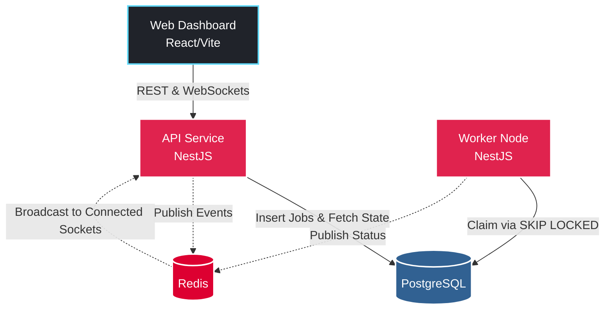
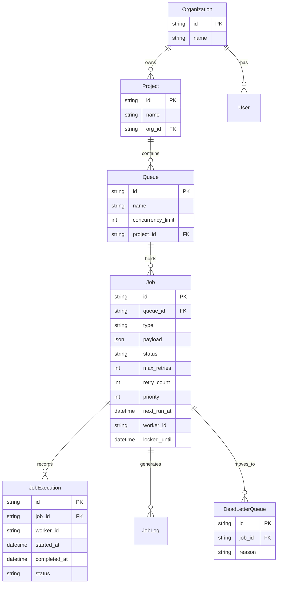

  <h1>Distributed Job Scheduler</h1>
  
<strong>A high-performance, fault-tolerant distributed job scheduler built for maximum reliability and concurrency.</strong>

  
<i>Intern Assignment Submission</i>

  
  
  
  
  

 

## 🌟 Overview

The Distributed Job Scheduler is an enterprise-grade background task queueing and processing system. Built as a microservices-inspired monorepo, it enables scalable, real-time background task execution while solving distributed problems like race conditions, duplicate processing, and worker node failures.

### Key Features
- **Idempotent Job Submission**: Prevent duplicate processing via client-provided `idempotency_key`.
- **High Concurrency (No Brokers)**: Utilizes PostgreSQL `FOR UPDATE SKIP LOCKED` for lock-free, atomic queue claiming, removing the need for Heavy brokers like Kafka/RabbitMQ.
- **Robust Scheduling**: Supports immediate, delayed, and recurring (CRON) jobs via strict AST parsing.
- **Fault Tolerant**: Built-in Dead Letter Queues (DLQ), configurable retry policies with exponential backoff, and automatic worker orphan detection/requeuing.
- **Real-Time Telemetry**: Real-time Socket.io updates backed by Redis Pub/Sub broadcast infrastructure.
- **Premium UX Dashboard**: Beautiful Glassmorphism React/Vite dashboard allowing deep insights into job execution logs.

---

## 🏗 System Architecture

The architecture relies on decoupled API and Worker services communicating via PostgreSQL for state and Redis for real-time signaling.

### Turborepo Structure
- **`@job-scheduler/database`**: Centralized Prisma ORM package with strict schema rules and partial indexing.
- **`apps/api`**: HTTP API and WebSocket gateway.
- **`apps/worker`**: Headless poll loop service. Runs completely isolated from HTTP traffic.
- **`apps/web`**: Frontend interactive application.

---

## 🗄️ Database Entity-Relationship

The database schema is heavily optimized for concurrent write-heavy throughput, enforcing foreign key integrity across Organizations, Projects, Queues, and Execution logs.

---

## 🚀 Getting Started

See **[HOW_TO_USE.md](./HOW_TO_USE.md)** for detailed instructions on spinning up the environment via Docker Compose, seeding test data, and starting all the microservices concurrently.

---

## 🛡️ Reliability & Engineering Tradeoffs

### Why PostgreSQL over RabbitMQ/Kafka?
By utilizing `SELECT ... FOR UPDATE SKIP LOCKED`, we can achieve atomic transitions of business logic and queue state in a **single database transaction**. This eliminates the Two-Phase Commit (2PC) problem often encountered when attempting to sync a primary relational database with a distinct message broker.

### Partitioned Rate Limiting
The system features a token bucket approach implemented inside the queue logic, ensuring that strict limits like *'Maximum of 10 concurrent active jobs for Queue A'* are globally respected across distributed worker nodes.

### Zero-Downtime Deployment
Deployments are entirely non-blocking. A worker can crash halfway through a job, and the `locked_until` lease expiration will trigger the Watchdog Daemon to reap and requeue the job automatically.

---
*Developed for the Distributed Systems engineering assignment.*
