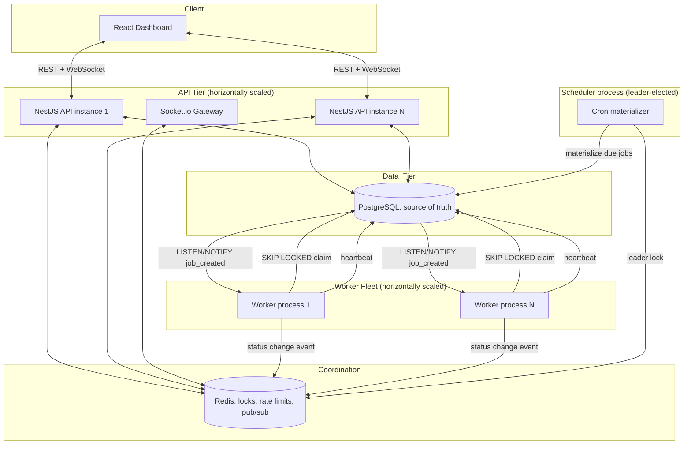
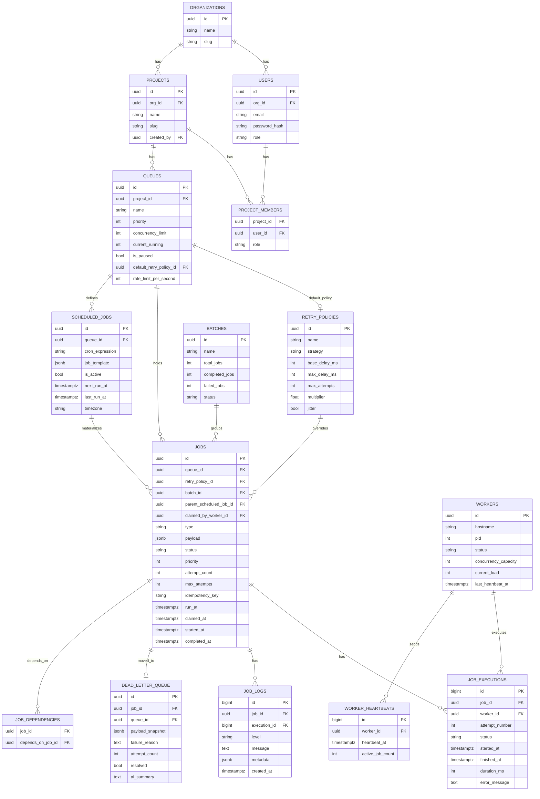
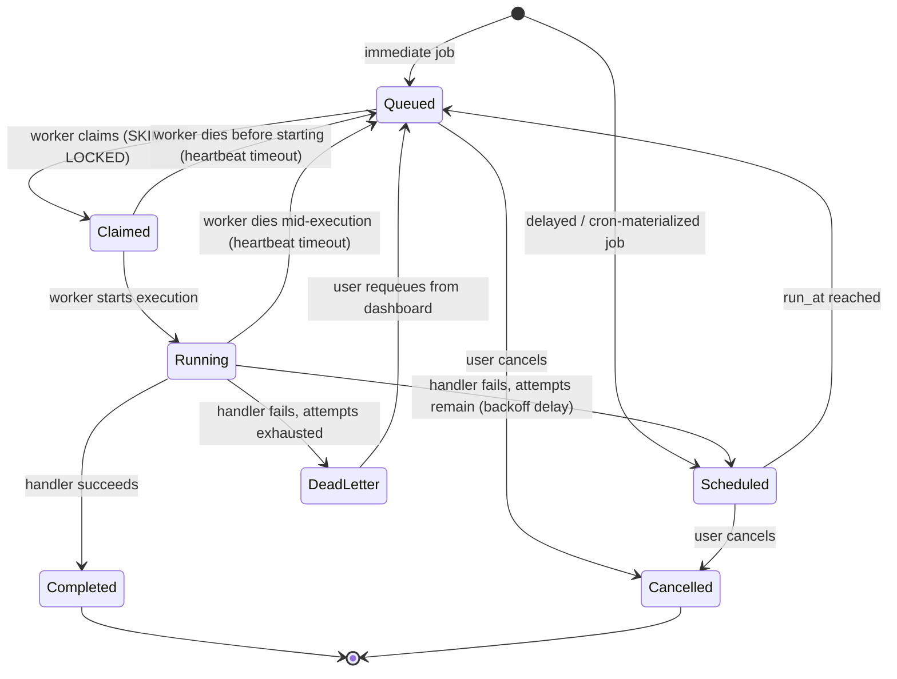

# Distributed Job Scheduler — Master Build Specification

> **Source assignment:** Intern Assignment — "Distributed Job Scheduler." Evaluated on engineering quality, modular architecture, database design, reliability, concurrency, observability, documentation, and maintainability — not feature count.

---

## 0. Instructions for AI

Treat this file as the single source-of-truth product + technical specification. Do not ask the user to re-explain scope — it is all below. Concretely:

1. **Generate `requirements.md`** from Section 2 (Functional Requirements, already in EARS notation) and Section 3 (Non-Functional Requirements). Keep the acceptance criteria as-is; expand only where a WHEN/THEN needs splitting into finer testable statements.
2. **Generate `design.md`** from Sections 4–9 (Architecture, Database, Job Lifecycle & Concurrency, API, Backend Modules, Worker Service, Frontend). The Mermaid diagrams in those sections are the architecture/ER/sequence diagrams required as deliverables — reuse them directly rather than regenerating from scratch.
3. **Generate `tasks.md`** from Section 12 (Phased Build Plan). Phase order is dependency order — respect it when building the task graph so wave-based concurrent execution groups correctly (Phase N tasks should not be scheduled before Phase N-1 dependencies they reference are marked done).
4. If generating steering docs (`product.md` / `structure.md` / `tech.md`), source them from Sections 1, 4, and 5 respectively.
5. Where a decision was already made in Section 5 (Tech Stack & Design Decisions), do not re-litigate it or substitute a different library/pattern without flagging the substitution and the reason.
5a. **Confirm with the student whether they are using self-hosted Postgres (default) or Supabase before generating `design.md`.** If Supabase, apply §4.1 in full — it changes connection handling, the real-time layer, and the distributed-lock bonus. Do not mix the two approaches (e.g. Supabase Postgres with a Redis pub/sub layer added on top for no reason).
6. Keep this file in the repo at `docs/SPEC.md` as the durable reference after specs are generated.

---

## 1. Project Brief

Build a production-inspired distributed job scheduling platform: users create projects, each project owns queues, queues hold jobs (immediate, delayed, scheduled/cron, recurring, batch), a horizontally-scalable worker fleet claims and executes jobs without double-execution, failures retry with configurable backoff and dead-letter after exhausting attempts, and a web dashboard gives full visibility into queues, jobs, workers, and system health.

The grader weighs backend depth over breadth:

| Criterion | Marks | Where covered in this doc |
|---|---|---|
| System Architecture | 20 | §4 |
| Database Design | 20 | §6 |
| Backend Engineering | 20 | §7, §9 |
| Reliability & Concurrency | 15 | §7, §10 |
| Frontend & UX | 10 | §11 |
| API Design | 5 | §8 |
| Documentation | 5 | §13 |
| Testing | 5 | §14 |

**Strategic reading of this table:** architecture + database + backend + reliability = 75 of 100 marks. Frontend is worth a third of what database design alone is worth. Build a clean, functional dashboard — do not chase pixel-perfect UI polish at the expense of the atomic-claim logic, the concurrency test, or the schema's indexing rationale. Effort should be allocated in roughly that proportion. This is the single highest-leverage decision a student misses.

---

## 2. Functional Requirements (EARS notation)

### 2.1 Authentication & Project Management

- **US-1:** As a user, I want to register and log in, so that my projects and jobs are private to my organization.
  - WHEN a user submits valid registration details THE SYSTEM SHALL create an account with a securely hashed password and SHALL NOT store plaintext passwords.
  - WHEN a user submits valid credentials THE SYSTEM SHALL issue a short-lived access token and a longer-lived refresh token.
  - WHEN an access token expires THE SYSTEM SHALL reject the request with 401 and a machine-readable error code.
  - WHEN a refresh token is presented and valid THE SYSTEM SHALL issue a new access token without requiring re-login.

- **US-2:** As a user, I want to create and manage projects, so that I can group related queues.
  - WHEN an authenticated user creates a project THE SYSTEM SHALL associate it with their organization and record the creator.
  - WHEN a user requests their project list THE SYSTEM SHALL return only projects belonging to their organization, paginated.

### 2.2 Queue Management

- **US-3:** As a user, I want to configure queues per project, so that I can control throughput and failure behavior per workload.
  - WHEN a user creates a queue THE SYSTEM SHALL require a unique name within the project and SHALL accept priority, concurrency limit, and an optional retry policy.
  - WHEN a user pauses a queue THE SYSTEM SHALL stop workers from claiming new jobs from that queue while allowing already-claimed jobs to finish.
  - WHEN a user resumes a paused queue THE SYSTEM SHALL make eligible jobs claimable again immediately.
  - WHEN a user requests queue statistics THE SYSTEM SHALL return counts by status, current throughput, and average execution duration.

### 2.3 Job Submission

- **US-4:** As a user, I want to submit jobs of different timing types through one API, so that I can cover immediate, delayed, scheduled, recurring, and batch workloads.
  - WHEN a job is submitted with no `run_at` THE SYSTEM SHALL mark it `queued` and make it immediately claimable.
  - WHEN a job is submitted with a future `run_at` THE SYSTEM SHALL mark it `scheduled` and SHALL NOT make it claimable until `run_at` has passed.
  - WHEN a recurring job definition is created with a cron expression THE SYSTEM SHALL compute the next `run_at` and materialize a concrete job row at each occurrence.
  - WHEN multiple jobs are submitted under one batch request THE SYSTEM SHALL tag them with a shared batch identifier and SHALL expose aggregate batch progress.
  - WHEN a job is submitted with an idempotency key already seen for that queue THE SYSTEM SHALL return the existing job instead of creating a duplicate.

### 2.4 Worker Execution

- **US-5:** As a system, I want workers to claim jobs atomically, so that no job is executed twice.
  - WHEN two or more workers attempt to claim from the same queue concurrently THE SYSTEM SHALL guarantee each eligible job is claimed by exactly one worker.
  - WHEN a worker claims a job THE SYSTEM SHALL transition it to `claimed` and then `running`, recording the worker id and timestamps.
  - WHEN a worker is executing jobs THE SYSTEM SHALL receive periodic heartbeats and SHALL mark a worker offline if heartbeats stop for longer than a configured timeout.
  - WHEN a worker is marked offline while holding claimed or running jobs THE SYSTEM SHALL requeue those jobs without counting the requeue as a failed attempt against the job's retry budget.
  - WHEN a worker receives a shutdown signal THE SYSTEM SHALL stop claiming new jobs, allow in-flight jobs to finish within a drain timeout, and exit cleanly.
  - WHEN a queue's concurrency limit is reached THE SYSTEM SHALL NOT allow additional jobs from that queue to enter `running` state until capacity frees up.

### 2.5 Retry, Failure & Dead-Letter

- **US-6:** As a user, I want configurable retry behavior, so that transient failures self-heal without manual intervention.
  - WHEN a job execution fails and attempts remain THE SYSTEM SHALL compute the next delay using the job's retry policy (fixed, linear, or exponential backoff) and SHALL return the job to `scheduled` with the new `run_at`.
  - WHEN a job exhausts its maximum attempts THE SYSTEM SHALL move it to the dead-letter queue and SHALL preserve its full failure history.
  - WHEN a user requeues a dead-lettered job from the dashboard THE SYSTEM SHALL reset its attempt count and resubmit it while preserving the original record for audit.

### 2.6 Observability & Dashboard

- **US-7:** As a user, I want full visibility into jobs, workers, and system health, so that I can operate the platform without reading logs by hand.
  - WHEN a job transitions state THE SYSTEM SHALL append an execution record and structured log entries queryable by job id.
  - WHEN a user opens the job explorer THE SYSTEM SHALL support filtering by status, queue, date range, and free-text search, with pagination.
  - WHEN a user opens the worker monitor THE SYSTEM SHALL show live status, current load, and last-heartbeat age for every worker.
  - WHEN system state changes (job completes, worker goes offline, queue is paused) THE SYSTEM SHALL push updates to connected dashboard clients without requiring a manual refresh.

---

## 3. Non-Functional Requirements

- WHEN the system is under concurrent load THE SYSTEM SHALL prevent duplicate job execution through database-level atomic claiming, not application-level locks alone.
- WHEN a job handler is invoked more than once for the same logical execution (crash-recovery scenario) THE SYSTEM SHALL document this as an at-least-once delivery contract and SHALL make job creation idempotent via idempotency keys.
- WHEN any API request fails validation or authorization THE SYSTEM SHALL return a structured error object with a stable error code, human-readable message, and (where applicable) field-level details.
- WHEN the system logs an event THE SYSTEM SHALL include a correlation id traceable from API request through worker execution.
- THE SYSTEM SHALL remain operable with more than one worker instance and more than one API instance running simultaneously (horizontal scalability as a first-class constraint, not an afterthought).

---

## 4. Tech Stack & Key Design Decisions

Stated as decisions with rejected alternatives, because "design decisions with trade-offs" is an explicit deliverable.

| Layer | Choice | Why | Rejected alternative |
|---|---|---|---|
| Backend framework | **NestJS (Node.js + TypeScript)** | Enforces modular architecture via modules/providers/DI out of the box — directly rewards the "modular architecture" grading criterion. Decorators make guards (auth/RBAC), interceptors (logging), and pipes (validation) explicit and testable. | Express (too unopinionated, modularity becomes self-discipline instead of structure); Python/FastAPI (equally valid, but weaker built-in DI story) |
| Job engine | **Built in-house on Postgres**, not delegated to a queue library | The assignment evaluates your ability to *build* a scheduler — atomic claiming, retry, DLQ, concurrency control are the point. | BullMQ / Celery / Sidekiq — production-correct, but would hide the exact logic being graded |
| Primary datastore | **PostgreSQL 16+** | Native `SELECT ... FOR UPDATE SKIP LOCKED` gives correct atomic multi-worker claiming without an external lock service. JSONB covers flexible payloads. `LISTEN/NOTIFY` enables event-driven wake-up. | MongoDB (no equivalent atomic-claim primitive without extra machinery); MySQL (SKIP LOCKED only since 8.0, weaker JSON tooling) |
| Coordination/cache | **Redis** | Distributed lock for scheduler leader election, token-bucket rate limiting, pub/sub fan-out for WebSocket updates across multiple API instances. | Postgres advisory locks alone (works for locking, but no pub/sub fan-out for horizontally-scaled API) |
| Real-time transport | **Socket.io** | Rooms map cleanly to per-project/per-queue subscriptions; automatic fallback to polling. | Raw WebSocket (more code for reconnection/rooms); pure polling (higher latency, more DB load) |
| Frontend | **React + TypeScript + Vite, TailwindCSS, shadcn/ui, TanStack Query, TanStack Table, Recharts, Zustand** | TanStack Query gives caching + polling/refetch-on-focus for free, reducing custom state code; Recharts covers throughput/health charts without a heavy charting stack. | Next.js (server-rendering not needed for an internal dashboard; adds deployment complexity for no benefit here) |
| ORM | **Prisma** | Type-safe schema + migrations; raw SQL escape hatch for the atomic-claim query, which Prisma's query builder cannot express safely. | TypeORM (weaker migration story); raw `pg` only (loses type safety everywhere else) |
| Primary keys | **UUID v4** for entity-identity tables (users, orgs, projects, queues, jobs, workers); **BIGINT IDENTITY** for high-volume append-only tables (job_logs, job_executions, worker_heartbeats) | UUIDs let clients generate job IDs client-side for idempotent retries and avoid cross-shard collision. Sequential bigints keep index locality and insert throughput high on tables that grow fastest. | All-UUID (index bloat on hot log tables); all-serial (weak for future sharding/idempotent client-generated IDs) |
| Containerization | **Docker + docker-compose** (api, worker ×N, postgres, redis, frontend, one-off seed job) | One-command grader setup: `docker compose up`. | Manual local setup instructions only — friction for whoever grades this |
| Testing | **Vitest/Jest + Supertest + Testcontainers + Playwright** | Testcontainers spins a real Postgres for the concurrency proof test (see §14) — a mocked DB cannot validate `SKIP LOCKED` behavior. | Fully mocked DB layer (cannot prove the one guarantee that matters most: no double-claim) |
| Logging | **pino**, structured JSON, request-scoped correlation id | Fast, structured, greppable; pairs with any log aggregator later. | console.log (ungoverned, ungreppable at scale) |
| Metrics (bonus) | **Prometheus client + `/metrics` endpoint** | Standard scrape format, cheap to add, strong observability signal to graders. | Custom metrics format |
| Managed Postgres option | **Supabase** (optional, in place of self-hosted Postgres + Redis pub/sub — see §4.1) | Same Postgres semantics for schema/claim logic; Realtime replaces a custom pub/sub layer for free; CLI keeps local dev reproducible | Fully self-hosting Postgres + Redis + Socket.io (more moving parts to operate, no material grading upside once Realtime covers the same requirement) |

### 4.1 Conditional instructions — if using Supabase instead of self-hosted Postgres

Default in this spec is self-hosted Postgres via docker-compose. Supabase (managed Postgres + Auth + Realtime + Storage) is Postgres underneath, so every schema, index, and atomic-claim decision in §6–§7 applies unchanged. **If the student selects Supabase, apply the following instead of the plain-Postgres defaults — do not silently mix both approaches:**

- **Keep unchanged:** the full schema (§6), every index, and the atomic-claim query plus concurrency-lock transaction (§7.1–7.2) — plain SQL, runs identically on Supabase.
- **Connection mode per process, not one URL for everything:**
  - API server (short request/response queries) → transaction pooler connection string (port 6543).
  - Worker process and scheduler process → session/direct connection string (port 5432), **not** the transaction pooler. `LISTEN/NOTIFY` and advisory locks require a persistent session; the transaction pooler recycles the underlying connection between statements and silently breaks both.
  - Expose both as `DATABASE_URL_POOLED` and `DATABASE_URL_DIRECT` in `.env.example`; wire each process's Prisma client to the correct one. Do not default every process to the pooled URL.
- **Simplify the real-time layer:** replace the Redis pub/sub + Socket.io bridge (§5, §11) with Supabase Realtime, which streams Postgres row-level changes (WAL-based) directly to subscribed dashboard clients on `jobs`, `workers`, and `queues`. This still satisfies the WebSocket live-updates bonus (§12) with one fewer coordination component. Update the architecture diagram in §5 accordingly: drop the Redis pub/sub box and the Socket.io gateway box, and add a direct Postgres → Supabase Realtime → dashboard edge.
- **Do not delegate authentication entirely to Supabase Auth.** "Implement authentication" is explicitly graded under Backend Engineering (§1). Write JWT issuance, refresh-rotation, and RBAC guard logic in the NestJS backend; Supabase's `auth.users` table may sit underneath it, but the demonstrated engineering must be the student's own.
- **Distributed-lock bonus without Redis:** implement scheduler leader election (§12) with `pg_advisory_lock` / `pg_try_advisory_lock` over the direct/session connection instead of a Redis `SET NX` lock. Functionally equivalent, one fewer moving part.
- **Keep local setup reproducible for the grader:** do not require a live cloud Supabase project as the only way to run the system — a free-tier project auto-pauses after a week of inactivity, which breaks the one-command-setup deliverable (§13) at the worst possible time. Use the Supabase CLI (`supabase start`) to run the full stack (Postgres, Auth, Realtime, Storage, Studio) locally via Docker, and document that path in `README.md` alongside how to point the same code at a real Supabase project for production.

---

## 5. System Architecture



**Components:**
- **API tier** — stateless NestJS instances behind a load balancer; any instance can serve any request, so scaling out is just adding instances.
- **Worker fleet** — independent processes (can run on separate hosts), each polling assigned queues and also listening for `NOTIFY` events for low-latency wake-up. Workers never talk to each other directly; Postgres is the only coordination point for claiming.
- **Redis** — used for three narrow purposes only: (1) leader election lock so exactly one scheduler process materializes cron jobs, (2) token-bucket rate limiting, (3) pub/sub so a status change seen by API-instance-1 reaches a dashboard client connected to API-instance-2.
- **Scheduler process** — a small standalone process (or a leader-elected instance among the workers) that scans `scheduled_jobs` for due entries and materializes rows into `jobs`. Leader election prevents duplicate materialization if run with multiple replicas for HA.
- **Postgres is the single source of truth** for job state. This is deliberate: correctness of "exactly one worker executes a job" must not depend on two systems agreeing — see §10.

---

## 6. Database Design



### 6.1 Table-by-table rationale

**organizations, users** — standard multi-tenant root. `users.password_hash` uses argon2id (or bcrypt cost ≥ 12). Index: `users(email)` unique. Cascade: deleting an organization cascades to users/projects only in non-production seed/test tooling — in the real API, org deletion is soft (an `is_active` flag), never a hard `ON DELETE CASCADE`, because job history is an audit record that must survive account changes.

**projects, project_members** — a project belongs to one organization; `project_members` is the bonus-RBAC junction table (`user_id`, `project_id`, `role`) so access can be finer-grained than one org-wide role. Index: composite PK `(project_id, user_id)`.

**queues** — `current_running` is a denormalized counter maintained transactionally alongside claims (see §10.2) specifically so the concurrency limit can be enforced with one row lock instead of a `COUNT(*)` scan on every claim. Unique constraint `(project_id, name)`. Index on `(project_id)`.

**retry_policies** — kept as its own table (not inlined JSON on queue/job) because policies are reused across queues and need to be independently editable/versionable. `strategy` is an enum: `fixed | linear | exponential`.

**jobs** — the hottest table in the system. Critical index:
```sql
CREATE INDEX idx_jobs_claimable
  ON jobs (queue_id, status, run_at)
  WHERE status IN ('queued', 'scheduled');
```
This partial index keeps the claim query's `WHERE` clause cheap even with millions of historical completed rows, because completed/failed/dead-letter rows never match the predicate and are excluded from the index entirely. Additional index on `idempotency_key` (unique, scoped per queue via a composite unique constraint `(queue_id, idempotency_key)`) to support the idempotent-creation requirement. Foreign keys: `queue_id → queues.id ON DELETE RESTRICT` (never silently drop job history when a queue is deleted — require explicit archival first).

**job_executions** — one row per *attempt*, separate from `jobs` (which holds only current state). This is the normalization decision worth stating explicitly: without this table, retry history would require either an unbounded array column (hard to query/index) or overwriting prior-attempt data (destroys the audit trail the assignment explicitly asks for — "retry history" is a named requirement). BIGINT identity PK for insert throughput.

**job_logs** — append-only, high volume, BIGINT identity PK, indexed on `(job_id, created_at)`. In production this table would be range-partitioned by month for easy archival — noted as a scale path in §10.5 rather than built for the assignment's expected data volume.

**workers, worker_heartbeats** — `workers` holds current state (one row per live worker, upserted); `worker_heartbeats` is the historical log used for uptime/health charts, not for liveness checks (liveness checks read `workers.last_heartbeat_at` directly — cheap, single row). This split avoids scanning a growing heartbeat table just to answer "is this worker alive."

**scheduled_jobs** — recurring/cron *definitions*, not jobs themselves. `job_template` (JSONB) holds the type/payload/priority to stamp onto each materialized row. `next_run_at` is computed by a cron-expression library on each materialization and indexed for the scheduler's due-scan: `CREATE INDEX ON scheduled_jobs (next_run_at) WHERE is_active`.

**dead_letter_queue** — a snapshot table, not a live queue. `payload_snapshot` freezes the job's payload at time of failure so later payload/schema changes don't corrupt historical failure analysis. `ai_summary` is nullable — populated only if the AI-summary bonus is enabled and an API key is configured.

**batches, job_dependencies** — bonus tables. `job_dependencies (job_id, depends_on_job_id)` is a self-referencing many-to-many on `jobs`; a job is only claimable once all rows where `job_id = X` reference jobs with `status = 'completed'`. This is the minimum schema needed for DAG-style workflow dependencies without a separate workflow engine.

### 6.2 Normalization summary

Third normal form throughout, with two deliberate, documented denormalizations: `queues.current_running` (a derived count, kept in sync transactionally for lock-cheap concurrency enforcement) and `dead_letter_queue.payload_snapshot` (a deliberate copy, not a live reference, because the DLQ is a historical record, not a live view). Every other table stores each fact exactly once and references it by foreign key elsewhere.

---

## 7. Job Lifecycle & Concurrency Model



### 7.1 Atomic claim (the core reliability guarantee)

```sql
UPDATE jobs
SET status = 'claimed',
    claimed_by_worker_id = $1,
    claimed_at = now(),
    attempt_count = attempt_count + 1
WHERE id = (
  SELECT id FROM jobs
  WHERE queue_id = $2
    AND status IN ('queued', 'scheduled')
    AND run_at <= now()
  ORDER BY priority DESC, run_at ASC
  FOR UPDATE SKIP LOCKED
  LIMIT $3
)
RETURNING *;
```
`FOR UPDATE SKIP LOCKED` makes this safe under arbitrary worker concurrency: if two workers race for the same row, the second worker's row lock attempt is skipped rather than blocked, so it moves on to the next eligible row instead of waiting or double-claiming. This is the standard correct pattern for building a job queue on a relational database and is the answer this assignment's "atomically claim jobs" requirement is testing for.

### 7.2 Concurrency limit enforcement

Claiming happens inside a transaction that also locks and checks the queue row:
```sql
BEGIN;
SELECT concurrency_limit, current_running FROM queues WHERE id = $2 FOR UPDATE;
-- if current_running >= concurrency_limit: COMMIT and back off, claim nothing
-- else: run the claim query above for (concurrency_limit - current_running) slots,
--       then UPDATE queues SET current_running = current_running + <claimed_count> WHERE id = $2;
COMMIT;
```
On job completion or failure, a corresponding `current_running = current_running - 1` runs in the same transaction as the status update. Keeping the counter inside Postgres (rather than a Redis counter) means the concurrency guarantee and the job-state guarantee share one transaction boundary — no window where Redis says "capacity available" but Postgres disagrees after a crash.

### 7.3 Heartbeats, orphan detection, graceful shutdown

- Workers `UPDATE workers SET last_heartbeat_at = now(), current_load = $n WHERE id = $worker_id` every 5–10s.
- A janitor task (runs in the scheduler process or as a cron-style background task in one API instance) periodically executes:
  ```sql
  UPDATE workers SET status = 'offline'
  WHERE status = 'active' AND last_heartbeat_at < now() - interval '30 seconds';
  ```
  followed by requeuing any `claimed`/`running` jobs whose `claimed_by_worker_id` now points to an offline worker — status reset to `queued`, `attempt_count` **not** incremented (infra failure, not a job failure), and a `job_logs` entry recorded noting the orphan-recovery.
- On `SIGTERM`, a worker: stops polling for new work, waits up to a configured drain timeout for in-flight jobs to finish, marks itself `draining` → `offline`, and exits. This satisfies "graceful shutdown" as a first-class behavior, not just a bare process kill.

### 7.4 Retry backoff formulas

| Strategy | Formula (attempt *n*, 1-indexed) | Example (base=1000ms, multiplier=2, max=300000ms) |
|---|---|---|
| Fixed | `delay = base_delay_ms` | 1s, 1s, 1s, 1s... |
| Linear | `delay = base_delay_ms * n` | 1s, 2s, 3s, 4s... |
| Exponential | `delay = min(base_delay_ms * multiplier^(n-1), max_delay_ms)` | 1s, 2s, 4s, 8s, 16s... capped at 300s |
| Jitter (optional, any strategy) | `delay = random(delay * 0.5, delay * 1.5)` | prevents thundering-herd retries after a shared dependency outage |

When `attempt_count >= max_attempts`, the job moves to `dead_letter_queue` instead of being rescheduled, with the full `payload_snapshot` and `last_error` preserved.

### 7.5 Idempotency contract

Two distinct idempotency concerns, both required by the assignment:
1. **Creation idempotency** — `(queue_id, idempotency_key)` unique constraint; a duplicate submission returns the original job (200/`existing: true`) rather than creating a second one.
2. **Execution idempotency** — because a worker can crash after finishing work but before marking the job complete, the system has at-least-once execution semantics. Document this explicitly for job-handler authors: handlers should be written to be safe to run twice (e.g., upserts instead of inserts, checking a side-effect's existence before repeating it). This is a documented contract, not something the scheduler can enforce on arbitrary user payloads.

---

## 8. API Design

Convention: `/api/v1`, JSON bodies, bearer JWT auth, cursor-based pagination (`?cursor=...&limit=50`) for high-growth tables (jobs, logs), offset pagination acceptable for small tables (queues, workers). Structured error shape:
```json
{ "error": { "code": "QUEUE_CONCURRENCY_INVALID", "message": "concurrency_limit must be >= 1", "details": { "field": "concurrency_limit" } } }
```

| Method | Path | Purpose |
|---|---|---|
| POST | `/auth/register` | Create account |
| POST | `/auth/login` | Get access + refresh token |
| POST | `/auth/refresh` | Rotate access token |
| GET/POST | `/projects` | List / create projects |
| GET/PATCH/DELETE | `/projects/:id` | Manage a project |
| GET/POST | `/projects/:id/queues` | List / create queues |
| GET/PATCH/DELETE | `/queues/:id` | Manage a queue |
| POST | `/queues/:id/pause`, `/queues/:id/resume` | Pause/resume |
| GET | `/queues/:id/stats` | Status counts, throughput, avg duration |
| POST | `/queues/:id/jobs` | Submit a job (immediate/delayed/scheduled via `run_at`, batch via `batch_id`) |
| GET | `/queues/:id/jobs` | Job explorer — filter by `status`, `date_from/to`, free-text; paginated |
| GET | `/jobs/:id` | Job detail |
| POST | `/jobs/:id/cancel` | Cancel a queued/scheduled job |
| GET | `/jobs/:id/executions` | Attempt history |
| GET | `/jobs/:id/logs` | Structured logs for the job |
| GET/POST | `/queues/:id/scheduled-jobs` | Manage recurring/cron definitions |
| GET | `/workers` | Worker monitor list |
| GET | `/dead-letter` | DLQ list, filterable by queue |
| POST | `/dead-letter/:id/requeue` | Requeue a dead-lettered job |
| GET | `/metrics` | Prometheus scrape endpoint (bonus) |
| WS | `/ws` (Socket.io) | Live job/worker/queue events, rooms per `project_id` |

All list endpoints support `page`/`cursor`, `limit` (default 25, max 100), and relevant `filter[...]` query params; all mutating endpoints validate via DTOs (`class-validator` in NestJS) before touching the database, returning 422 with field-level errors on failure. OpenAPI 3.0 spec generated from NestJS decorators (`@nestjs/swagger`), served at `/api/docs`, satisfies the API-documentation deliverable directly from code rather than as a hand-maintained parallel document.

---

## 9. Backend Module Breakdown (NestJS)

```
src/
  auth/              # register, login, refresh, guards, RBAC decorators
  organizations/
  projects/
  queues/            # CRUD, pause/resume, stats
  jobs/              # submission, cancellation, job explorer queries
  retry-policies/
  scheduled-jobs/    # cron/recurring definitions + materializer task
  dead-letter/       # DLQ listing + requeue
  workers/           # worker registration, heartbeat endpoint, monitor queries
  job-logs/
  realtime/          # Socket.io gateway, Redis pub/sub bridge
  common/
    interceptors/    # logging, correlation-id
    filters/         # structured error responses
    guards/          # JWT auth guard, roles guard
    pipes/           # validation
  worker-process/    # the standalone worker entrypoint (separate deploy artifact)
    poller.ts        # claim loop + LISTEN/NOTIFY subscriber
    executor.ts      # runs job handlers, captures result/error
    heartbeat.ts
    shutdown.ts
```

Each domain module (`queues`, `jobs`, `workers`, ...) follows Nest's controller → service → repository (Prisma) layering, keeping HTTP concerns, business rules, and persistence in separate files — this is the concrete, inspectable form of the "modular architecture" the grader is scoring.

---

## 10. Worker Service Design

Pseudocode for the poll loop:
```
on startup:
  register worker row (status=active)
  start heartbeat interval (every 5-10s)
  subscribe LISTEN job_created channel (per assigned queue)

loop while status == active:
  wait for: poll interval tick  OR  NOTIFY event  (whichever first)
  for each assigned queue:
    run atomic claim transaction (§7.2) for up to available capacity
    for each claimed job (run concurrently up to capacity):
      execute handler(payload)
      on success: mark completed, decrement current_running, emit event
      on failure: compute backoff (§7.4), reschedule or move to DLQ, decrement current_running, emit event

on SIGTERM:
  status = draining
  stop claiming
  await in-flight jobs (bounded by drain timeout)
  status = offline
  exit
```
`LISTEN/NOTIFY` is driven by a Postgres trigger firing `NOTIFY job_created, '<queue_id>'` on insert into `jobs` — this closes the latency gap of pure polling (bonus: "event-driven execution") while the poll interval remains as a safety net so a missed/dropped notification never stalls a queue indefinitely.

---

## 11. Frontend Dashboard Spec

| Page | Contents |
|---|---|
| Login / Register | Auth forms, token storage in memory + httpOnly refresh cookie |
| Project switcher | Org's projects, create new |
| Queue list | Cards/table: name, priority, concurrency, paused state, quick stats |
| Queue detail | Full config form (priority, concurrency, retry policy, rate limit), pause/resume toggle, throughput + success-rate charts (Recharts), recent jobs |
| Job explorer | TanStack Table: filter by status/queue/date, search, pagination; row click opens job detail drawer |
| Job detail | Status, timeline of executions (attempt-by-attempt), structured logs, payload viewer, cancel/retry actions |
| Worker monitor | Live table: hostname, status, current load / capacity, last heartbeat age (color-coded stale > 30s) |
| Dead-letter queue | Filterable list, payload snapshot, error, AI summary (if enabled), requeue/discard actions |
| System health | Aggregate throughput, error rate, queue depth over time |

Data fetching: TanStack Query for all REST calls (handles caching, background refetch, retry-on-error). Live updates: Socket.io client joins a room per active `project_id`; incoming events (`job.updated`, `worker.updated`, `queue.stats`) patch the TanStack Query cache directly (`queryClient.setQueryData`) instead of triggering a full refetch, keeping the UI responsive under high event volume.

---

## 12. Bonus Features — Recommended Build Order

Ranked by marks-per-effort for a student aiming for the top bracket:

1. **Event-driven execution** (LISTEN/NOTIFY) — small addition on top of the poller already being built; visibly improves latency; directly demonstrates deeper Postgres knowledge.
2. **WebSocket live updates** — already required by the dashboard spec above; formalizing it as "done" is nearly free.
3. **Role-based access control** — `project_members` table + a Nest guard reading role from the JWT/DB; a few hours, meaningfully raises "System Architecture" and "Backend Engineering" scores.
4. **Distributed locking** (Redis leader election for the scheduler process) — needed the moment more than one scheduler replica exists; cheap to implement with a TTL'd `SET NX` lock and renewal loop.
5. **Rate limiting** — token bucket in Redis, applied at (a) API layer per-project for abuse prevention and (b) queue-execution layer to protect downstream dependencies.
6. **Workflow dependencies** — `job_dependencies` table (already modeled in §6) + a claim-query predicate excluding jobs whose dependencies aren't all `completed`.
7. **Queue sharding** — worth a paragraph in the design-decisions doc discussing how `jobs`/`job_logs` would be range-partitioned by month and how queues could be routed to shard groups by hashing `queue_id`; full physical sharding is disproportionate effort for the grading weight, so document the plan rather than over-building it.
8. **AI-generated failure summaries** — call an LLM with the error + recent logs when a job lands in DLQ; nice-to-have polish, lowest marks-per-effort of the list, do last if time remains.

---

## 13. Documentation Deliverables

- `README.md` — one-command setup (`docker compose up`), env vars (`.env.example`), seed script producing a demo org/project/queues/jobs so a grader sees a populated system within minutes of cloning, not an empty shell.
- `docs/ARCHITECTURE.md` — the diagrams from §5–§7 plus prose.
- `docs/ERD.md` — the diagram from §6.
- `docs/DESIGN_DECISIONS.md` — the table in §4, expanded with any decisions made during actual implementation that deviate from this spec (and why).
- `docs/API.md` or generated OpenAPI/Swagger UI at `/api/docs` — satisfies API documentation from code.
- Inline code comments only where intent isn't obvious from naming — favor self-documenting code over comment density.

---

## 14. Testing Strategy

- **Unit tests:** retry-delay calculation (all three strategies + jitter bounds), cron next-run-at calculation, state-transition validator (illegal transitions rejected).
- **Integration tests (Testcontainers, real Postgres):** the single highest-value test in the whole suite — spin up N simulated workers claiming concurrently from one queue with M eligible jobs, assert every job is claimed by exactly one worker and no job is claimed twice. This is the direct, automated proof of the "atomically claim jobs" requirement and should be called out by name in the README as the reliability proof.
- **API tests (Supertest):** auth flows, validation errors, pagination/filtering correctness, structured error shape.
- **E2E (Playwright):** one critical path — create queue → submit job → observe it complete on the dashboard via live update, no manual refresh.
- Automated on every push via a CI workflow (lint → unit → integration → build) — even a minimal GitHub Actions file signals engineering maturity disproportionate to its cost.

---

## 15. Phased Build Plan

Dependency-ordered; each phase assumes the previous is functionally complete. Use this to generate `tasks.md`.

- **Phase 0 — Scaffolding:** monorepo structure, NestJS app, Prisma init, docker-compose (postgres, redis), env config, lint/format setup.
- **Phase 1 — Schema:** all tables from §6 as Prisma migrations, including the partial index on `jobs` and the `(queue_id, idempotency_key)` unique constraint.
- **Phase 2 — Auth:** register/login/refresh, password hashing, JWT guard, roles groundwork.
- **Phase 3 — Projects & Queues:** CRUD + pause/resume + stats endpoint.
- **Phase 4 — Job submission API:** all five submission types (immediate/delayed/scheduled/recurring/batch), idempotency-key handling, validation.
- **Phase 5 — Worker service core:** atomic claim transaction, concurrency-limit enforcement, basic poll loop, job execution + completion/failure transitions.
- **Phase 6 — Retry & DLQ:** backoff calculators, DLQ move-on-exhaustion, requeue-from-DLQ endpoint.
- **Phase 7 — Reliability hardening:** heartbeats, orphan detection/requeue, graceful shutdown, `LISTEN/NOTIFY` wake-up.
- **Phase 8 — Scheduled/cron materializer:** cron parsing, due-scan, leader election lock for multi-replica safety.
- **Phase 9 — Observability:** structured logging with correlation ids, `job_logs`/`job_executions` writes wired through the execution path, `/metrics` endpoint.
- **Phase 10 — Frontend core:** auth pages, project/queue CRUD UI, job explorer, job detail drawer.
- **Phase 11 — Real-time:** Socket.io gateway + Redis pub/sub bridge, dashboard live-patching.
- **Phase 12 — Bonus features:** in the order given in §12, as time allows.
- **Phase 13 — Testing:** unit + integration (concurrency proof) + API + E2E, wired into CI.
- **Phase 14 — Documentation polish:** README, seed script, ARCHITECTURE/ERD/DESIGN_DECISIONS docs, final pass on OpenAPI descriptions.

---

## 16. Definition of Done (self-check against the rubric)

- [ ] Every table in §6 exists with the stated PKs/FKs/indexes and cascade behavior is deliberate, not default.
- [ ] The atomic-claim query is exactly the `SKIP LOCKED` pattern (or an equivalently correct alternative that is explicitly justified in `DESIGN_DECISIONS.md`).
- [ ] The concurrency-proof integration test exists, runs against a real Postgres via Testcontainers, and passes.
- [ ] All three retry strategies are implemented and unit-tested against the formulas in §7.4.
- [ ] Workers heartbeat, get marked offline on timeout, and their in-flight jobs are requeued without penalizing retry count.
- [ ] Graceful shutdown is implemented, not just process termination.
- [ ] The dashboard shows queues, job explorer, worker monitor, and DLQ, all live-updating without manual refresh.
- [ ] API responses use a consistent structured error shape and support pagination/filtering everywhere listed in §8.
- [ ] README brings the whole system up with one command and seeds demo data.
- [ ] Architecture diagram, ERD, API docs, and a design-decisions document with real trade-offs all exist as separate, readable artifacts.
