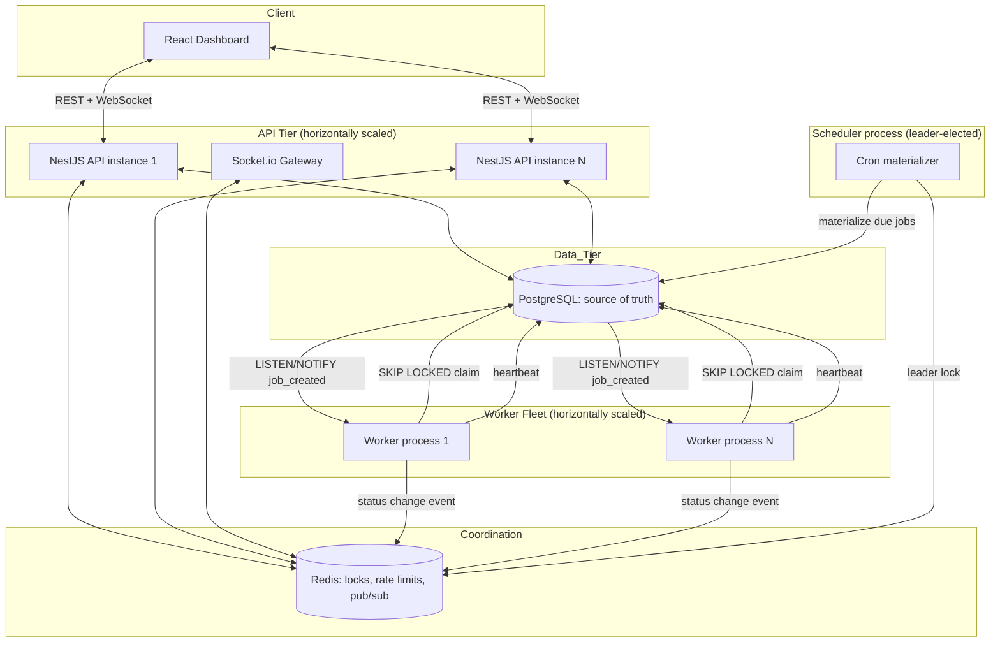
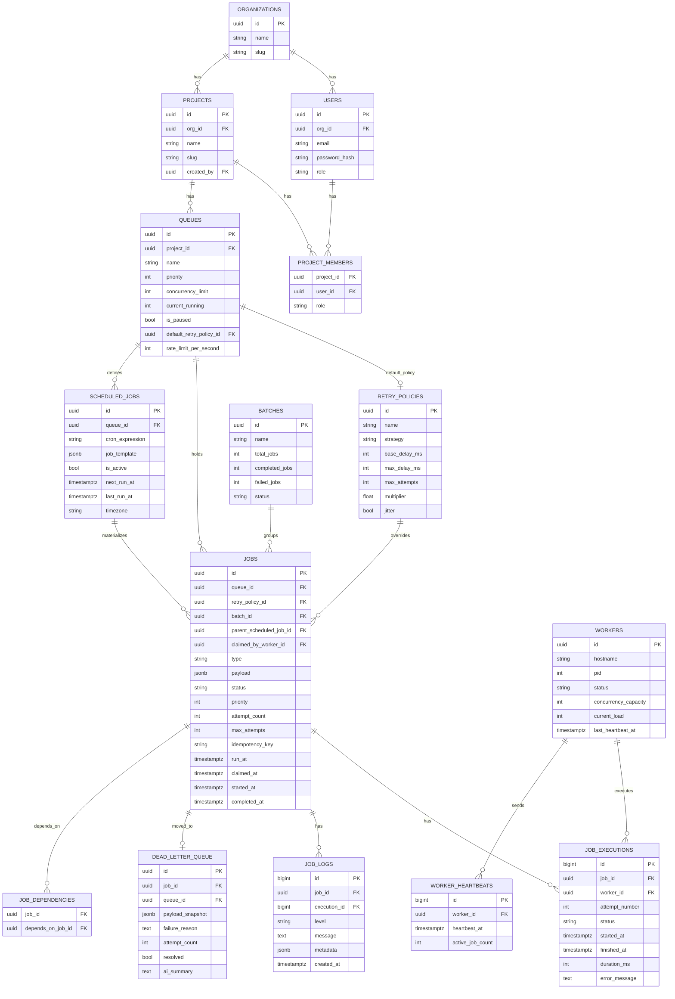
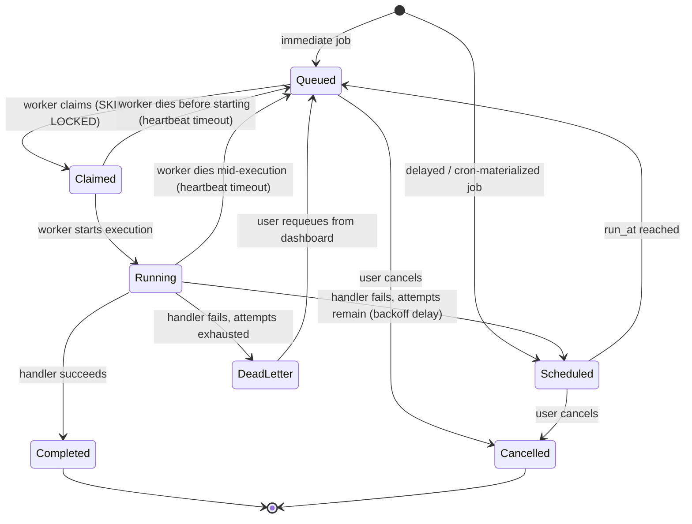

# Design Document

## System Architecture



## Database Design



## Job Lifecycle



## Backend Modules Breakdown (NestJS)

```
src/
  auth/              # register, login, refresh, guards, RBAC decorators
  organizations/
  projects/
  queues/            # CRUD, pause/resume, stats
  jobs/              # submission, cancellation, job explorer queries
  retry-policies/
  scheduled-jobs/    # cron/recurring definitions + materializer task
  dead-letter/       # DLQ listing + requeue
  workers/           # worker registration, heartbeat endpoint, monitor queries
  job-logs/
  realtime/          # Socket.io gateway, Redis pub/sub bridge
  common/
    interceptors/    # logging, correlation-id
    filters/         # structured error responses
    guards/          # JWT auth guard, roles guard
    pipes/           # validation
  worker-process/    # the standalone worker entrypoint (separate deploy artifact)
    poller.ts        # claim loop + LISTEN/NOTIFY subscriber
    executor.ts      # runs job handlers, captures result/error
    heartbeat.ts
    shutdown.ts
```
