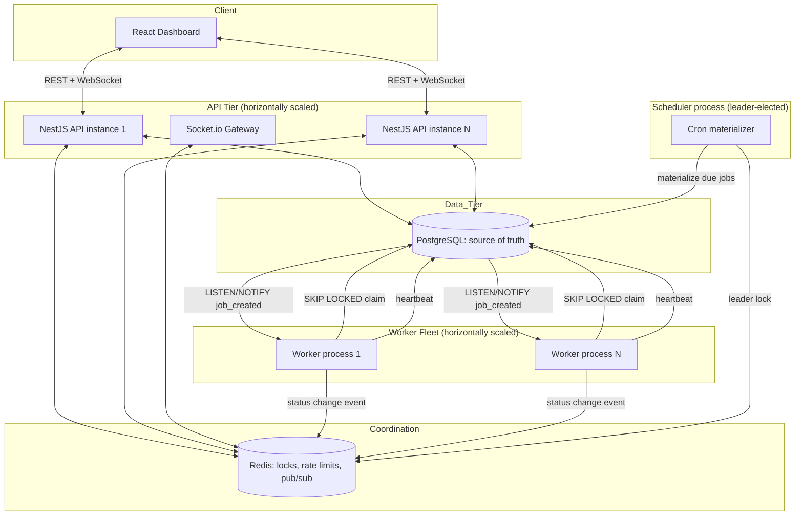

# System Structure

**Components:**
- **API tier** — stateless NestJS instances behind a load balancer; any instance can serve any request, so scaling out is just adding instances.
- **Worker fleet** — independent processes (can run on separate hosts), each polling assigned queues and also listening for `NOTIFY` events for low-latency wake-up. Workers never talk to each other directly; Postgres is the only coordination point for claiming.
- **Redis** — used for three narrow purposes only: (1) leader election lock so exactly one scheduler process materializes cron jobs, (2) token-bucket rate limiting, (3) pub/sub so a status change seen by API-instance-1 reaches a dashboard client connected to API-instance-2.
- **Scheduler process** — a small standalone process (or a leader-elected instance among the workers) that scans `scheduled_jobs` for due entries and materializes rows into `jobs`. Leader election prevents duplicate materialization if run with multiple replicas for HA.
- **Postgres is the single source of truth** for job state. This is deliberate: correctness of "exactly one worker executes a job" must not depend on two systems agreeing — see §10.
