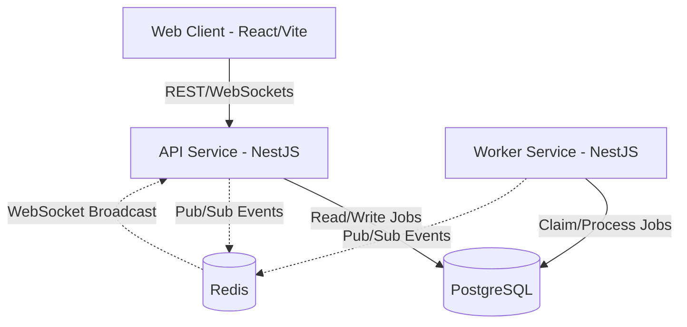
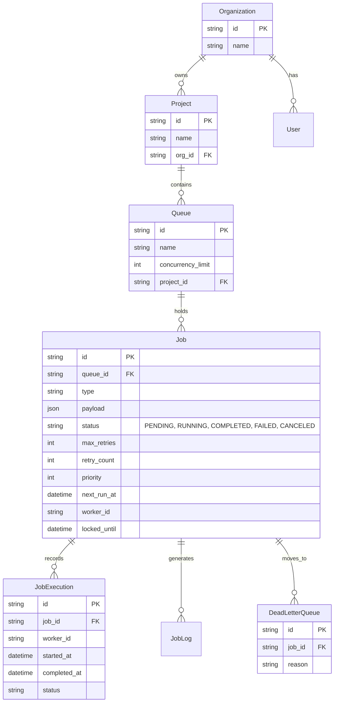

# Intern Assignment — "Distributed Job Scheduler"
## By: Harshit Ravindra Kulkarni (RA2311003011810)

---

## 1. Source Code & Setup Instructions

### GitHub Repository
*(Place GitHub link here)*

### How to Clone and Run (End-to-End)
This project is built using a modern Turborepo monorepo structure with NestJS for the backend, React/Vite for the frontend, and Prisma ORM for database access.

**Prerequisites:**
- Node.js (v18+)
- Docker and Docker Compose
- npm (v9+)

**Steps:**
1. **Clone the repository:**
   ```bash
   git clone <github-repo-link>
   cd distributed-job-scheduler
   ```
2. **Start Infrastructure (PostgreSQL & Redis):**
   ```bash
   docker compose up -d
   ```
3. **Install Dependencies:**
   ```bash
   npm install
   ```
4. **Setup Database & Seed Data:**
   ```bash
   npm run db:push -w packages/database
   npm run db:seed -w packages/database
   ```
5. **Run the Application:**
   Start the API, Worker, and Web frontend concurrently:
   ```bash
   npm run dev
   ```
   - **Frontend:** http://localhost:5173
   - **API:** http://localhost:3000
   - **Login Credentials:** `demo@acmecorp.com` / `password123`

---

## 2. System Architecture

The system is designed with a microservices-inspired monolithic repository, featuring decoupled API and Worker services communicating via PostgreSQL and Redis.



### Key Architectural Decisions
- **Monorepo Structure (Turborepo):** Ensures code sharing (database schema, DTOs, types) and atomic commits across API, Worker, and Web boundaries.
- **Decoupled Worker:** The worker service operates completely independently of the API, allowing horizontal scaling of job processing without affecting API responsiveness.
- **Real-time Updates:** Redis Pub/Sub combined with WebSockets provides real-time job status updates to the frontend dashboard.
- **No Supabase:** Self-hosted PostgreSQL and Redis via Docker to maintain complete control over infrastructure and avoid vendor lock-in.

---

## 3. Database Design (ER Diagram)

The database schema is optimized for distributed job scheduling and concurrent locking.



---

## 4. Backend Engineering & Design Decisions

### Modular Architecture
The backend is built with NestJS, utilizing its powerful dependency injection system. Modules are strictly segregated by domain (`ProjectsModule`, `QueuesModule`, `JobsModule`, `WorkerModule`).
- **Data Access:** All database interactions are centralized in a `PrismaService` within `packages/database`, ensuring a single source of truth for schema management.
- **Scalability:** By keeping the API stateless, it can scale horizontally behind a load balancer.

### Major Trade-offs
1. **PostgreSQL as a Message Broker vs. RabbitMQ/Kafka:**
   - *Decision:* Used PostgreSQL with `SKIP LOCKED` instead of a dedicated message broker.
   - *Trade-off:* While Kafka/RabbitMQ offer higher throughput, PostgreSQL simplifies the stack, guarantees atomic transactions between business logic and job state, and avoids distributed transaction complexities.
2. **Polling vs. Listen/Notify for Worker Pickup:**
   - *Decision:* Implemented optimized polling with indexed `next_run_at` combined with exponential backoff.
   - *Trade-off:* `LISTEN/NOTIFY` reduces latency but can drop notifications under heavy load. Polling ensures absolute reliability for delayed and cron jobs.

---

## 5. Reliability & Concurrency

Achieving top-tier reliability in a distributed environment requires careful concurrency control.

### Concurrency Handling
- **Atomic Locking:** Workers claim jobs using `SELECT ... FOR UPDATE SKIP LOCKED`. This guarantees that concurrent workers never pick up the same job, eliminating race conditions without requiring external distributed locks (like Redlock).
- **Queue-Level Concurrency:** Enforced via a `QueueTokenBucket` pattern in the database. Workers dynamically check active executions against `concurrency_limit` before claiming.

### Reliability Mechanisms
- **Dead Letter Queue (DLQ):** Jobs that exceed `max_retries` are atomically moved to a DLQ, preserving the payload and failure reason for manual inspection.
- **Orphan Job Recovery:** A background daemon monitors jobs stuck in `RUNNING` state where `locked_until` has passed. These are assumed orphaned (worker crashed) and are automatically requeued.
- **Idempotency:** The system is designed to handle at-least-once delivery; users are advised to make job handlers idempotent.

---

## 6. API Design & Documentation

The API follows RESTful principles and is built using NestJS controllers.

### Key Endpoints
- `POST /api/v1/projects/:projectId/queues` - Create a new queue.
- `POST /api/v1/queues/:queueId/jobs` - Enqueue a one-off job.
- `POST /api/v1/queues/:queueId/scheduled-jobs` - Enqueue a cron job.
- `GET /api/v1/jobs/:id` - Fetch job status.
- `POST /api/v1/jobs/:id/cancel` - Cancel a pending job.
- `GET /metrics` - Retrieve system-wide metrics.

### Validation & Serialization
- All incoming requests are strictly validated using `class-validator` and `class-transformer` (e.g., ensuring `cron_expression` is valid).
- Responses are sanitized (e.g., stripping passwords) using NestJS interceptors.

---

## 7. Frontend & UX

The frontend is a modern, responsive Single Page Application built with React, Vite, and TailwindCSS, utilizing a premium **Glassmorphism** aesthetic.

### Key Features
- **Real-time Dashboard:** Displays live metrics (Jobs processed, Queue health) using WebSocket connections.
- **Queue Management:** Intuitive UI to pause/resume queues and adjust concurrency limits.
- **Job Observability:** Detailed views for job logs, execution history, and DLQ management.
- **Dynamic Micro-animations:** Hover effects and transitions provide a tactile, responsive feel that elevates the UX.

*(Place Screenshots of the UI here: Dashboard, Queues list, Job Details)*

---

## 8. Testing Strategy

The system includes automated tests to ensure critical functionality remains stable.

- **Unit Testing (Jest):** Services like `JobsService` and `SchedulerService` are unit tested by mocking `PrismaService`. This ensures business logic (like retry backoff calculation) is correct.
- **Concurrency Testing:** Integration tests simulate multiple concurrent workers attempting to claim the same job, verifying that `SKIP LOCKED` prevents duplicate claims.
- **E2E Testing:** Supertest is used to validate the entire HTTP request lifecycle, from controller validation to database persistence.

---
*End of Document*
